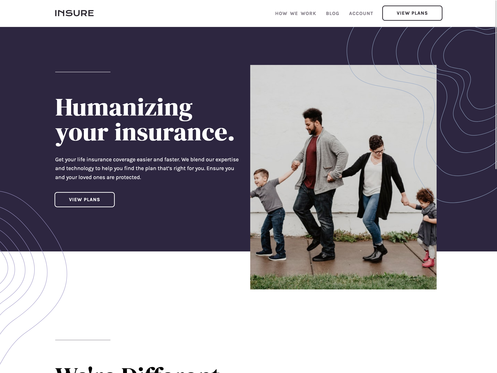

## Table of contents

- [Table of contents](#table-of-contents)
- [Overview](#overview)
  - [The challenge](#the-challenge)
  - [Screenshot](#screenshot)
  - [Links](#links)
- [My process](#my-process)
  - [Built with](#built-with)
- [Author](#author)

## Overview

### The challenge

Users should be able to:

- View the optimal layout for the site depending on their device's screen size
- See hover states for all interactive elements on the page

### Screenshot

### Links

- Solution URL: [https://github.com/andrewteece/insure-landing](https://your-solution-url.com)
- Live Site URL: [https://andrewteece.github.io/insure-landing/](https://your-live-site-url.com)

## My process

### Built with

- Semantic HTML5 markup
- CSS custom properties
- Flexbox
- JavaScript
- Mobile-first workflow

## Author

- Website - [https://andrewteece.com/](https://www.your-site.com)
- Frontend Mentor - [@andrewteece](https://www.frontendmentor.io/profile/yourusername)
- Twitter - [@teece_andrew](https://www.twitter.com/yourusername)

